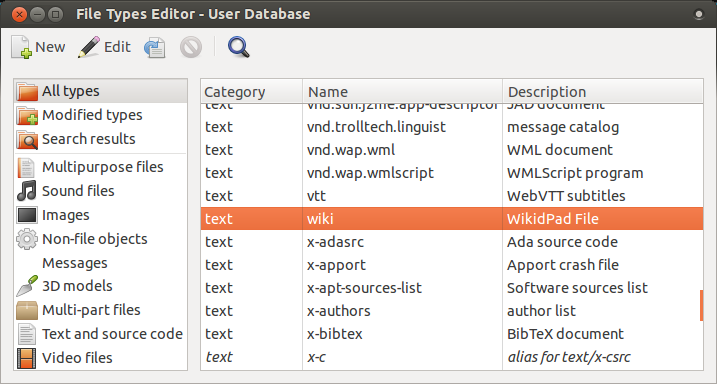
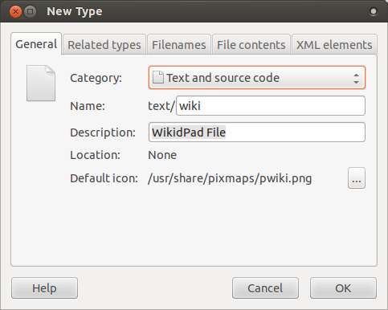
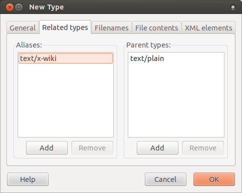
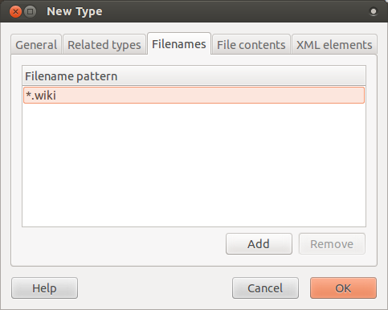

# wikidpad-utils
Proper launcher for WikidPad on Ubuntu

## Overview
This is a simple helper script to effectively launch
[WikidPad](http://wikidpad.sourceforge.net) on Ubuntu. WikidPad worked very well
on Ubuntu, but launching the program wasn't very smart at all. These instructions
and this script help you setup WikidPad on Ubuntu the way you expect it to work.
That is, like this:

`wikidpad ~/wikipath/myawesome.wiki`

and not like this:

`/opt/WikidPad/WikidPad.py --wiki ~/wikipath/myawesome.wiki`

Plus, right clicking on a .wiki file to open will open THAT file, not just the
last one opened.

At the moment, this script only includes the single functionality of launching
programs using `wikidpad` with a target filepath following it without a need to
prefix the installation path. As for the other options built into the program,
it only supports use of the `-h` and `--wiki` options at the moment. Feel free
to contribute and add some more.

This script is probably more portable and logical as a Bash script, but I wanted
to practice my python anyway. Feel free to contribute your Bash version!

## Requirements
Python 2.7.3, WikidPad

## Installation and Setup
First, download the WikidPad source to a location on your system. Then extract
it to a spot where it will live permanently, I suggest: `/opt/WikidPad`.

Next, download this package and extract it to a temporary location. In a
terminal, go to that location and if you have python installed:

`python setup.py install` which will install the package to your
`/usr/local/lib/python2.7/dist-packages` folder and the script to your
`/usr/local/bin` folder.

If you don't like to muddy up your `dist-packages`
folder, feel free just to sym-link from the downloaded package into your
`/usr/local/bin` folder. I do this sometimes to make it easy to continue to edit
my scripts.

`sudo ln -s /wherever/you/put/scripts/wikidpad-utils/bin/wikidpad /usr/local/bin`

So this now allows your standard terminal use. Running `wikidpad` in the
terminal will launch the program as you would expect, and appending a filepath
behind it will open up the wiki at that location. But now we need to add
support for the `.wiki` filetype so that when we double click on `.wiki` files, it
will open not just WikidPad, but also the exact wiki we clicked on.

### Filetypes
There are [more official
ways](http://stackoverflow.com/questions/2060284/how-to-use-the-xdg-mime-command)
to do this that are system-wide solutions. For those that want to attempt, I've
included the appropriate .xml file for use with `xdg-mime`. But for those that
don't mind it just being setup for your user profile, just get
[Assogiate](https://launchpad.net/ubuntu/+source/assogiate) and save yourself
the trouble.

The following installs the new mime-type to `~/.local/share/mime` instead of the
Ubuntu distributions location of `/usr/share/mime`. I assume xdg-mime would have
put it there instead.

* install then run Assogiate from terminal:

    `sudo apt-get install assogiate`

    `assogiate`

    > pro-tip: to get assogiate to show up in the Unity dash, edit
    > `~/.local/share/applications/assogiate.desktop` from a terminal and make
    > `Hidden=false`. Why this is on by default eludes me.

* create new mime-type

* Fill out the type information

* Filename extension

* leave the other two tabs empty

You now have the custom mime-type installed. Now to get it to show up in your
Unity dash.

* copy the icon to the Ubuntu pixmaps folder:

`sudo cp -a ./wikidpad-utils/filetype/pwiki.png /usr/share/pixmaps`

* copy the application launcher to your home folder:

`cp ./wikidpad-utils/filetype/WikidPad.desktop ~/.local/share/applications`

Logout and back in and it should show up there.

The last thing to do is associate the .wiki filetype with WikidPad so that you
can use the double-click and right-click actions on .wiki files.

edit `~/.local/share/applications/mimeapps.list` and add the line
`text/wiki=WikidPad.desktop;` to the end of the `[Added Associations]` section.

That last effect should be immediate. Double left-click or right-click and
voilà!

## Contribution
Suggestions and contributions to wikidpad-utils are always welcome and
appreciated.  Please see the [CONTRIBUTING](CONTRIBUTING.MD) file for
instructions.

## Releases
The most recent version will always be the `master` branch here on GitHub.

## License
wikidpad-utils is licensed under the MIT license. See the
[LICENSE](LICENSE-MIT) file.

## Credits
For a list of contributers, see the [AUTHORS](AUTHORS.md) file.
